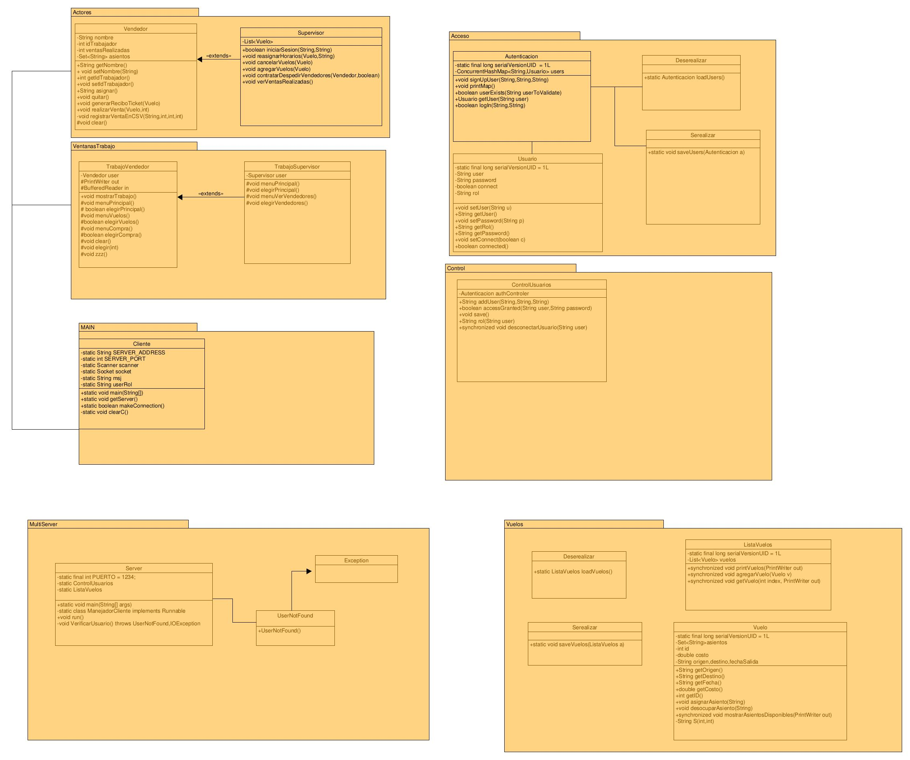
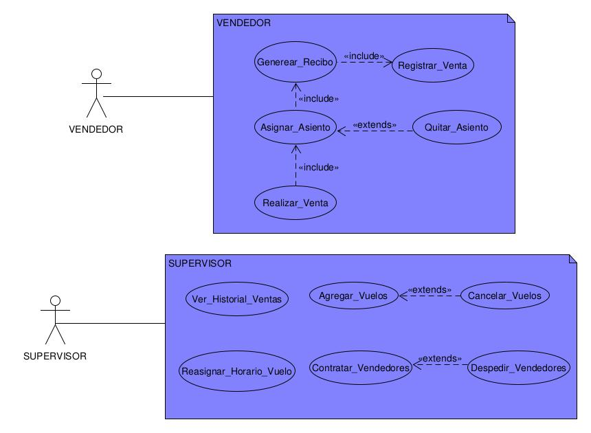

# Sistema de venta de vuelos

Sistema cliente-servidor para vender boletos de vuelos. El sistema es capaz de llevar el control
de ventas en cada punto de venta, asignar lugares en el vuelo deseado y generar un ticket de cobro,
y los boletos del vuelo adquirido.

Es capaz de revisar que los boletos adquiridos no sobrelapen asientos, y que sea en un vuelo valido,
es decir, que no este lleno, inexistente o que ya partio.

Se lleva un registro de los vuelos, y la venta de boletos a los lugares

## Diagramas Uml

